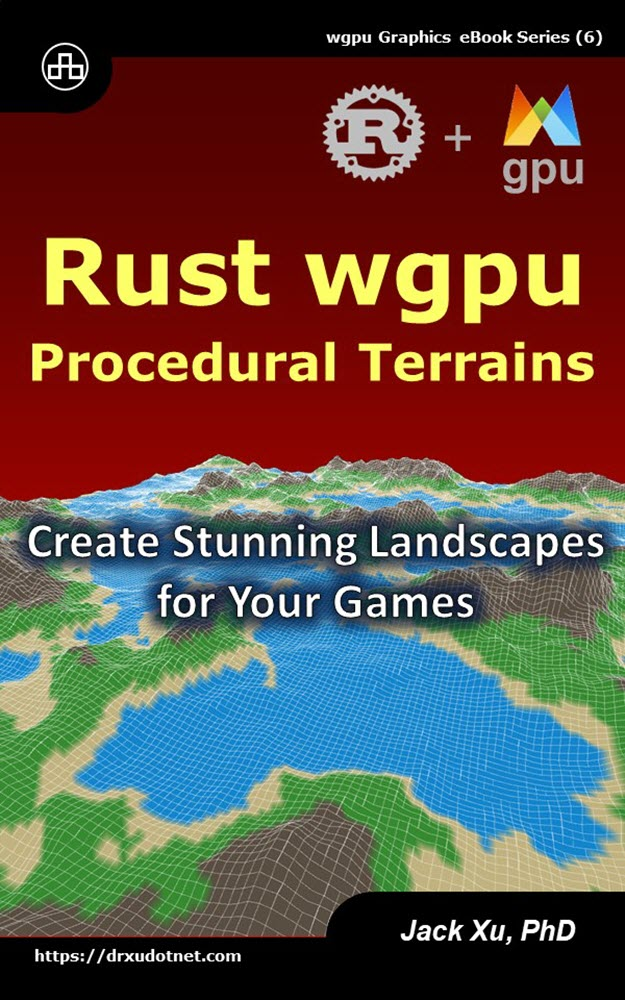

# Rust wgpu Procedural Terrains 
## Create Stunning Landscapes for Your Games

This is the source code of example projects contained in the eBook ["Rust wgpu Procedural Terrains"](https://www.amazon.com/exec/obidos/ASIN/B0CM4FQH6H/unicadinccom-20). 

